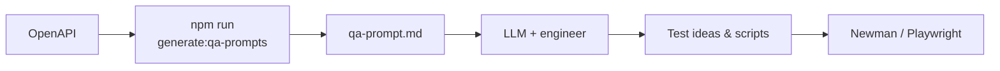
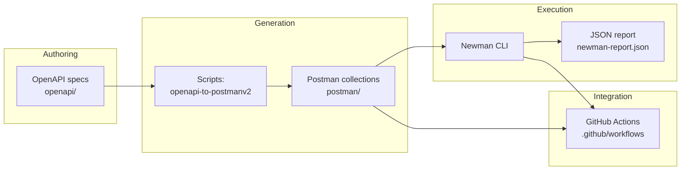

# AI QA Automation Toolkit

## Summary

- **Contract-driven API checks** — OpenAPI feeds Postman generation and Newman so HTTP behavior is verified as the spec evolves.
- **CI-ready defaults** — Pull requests run Newman with JSON artifacts; Playwright can join the same workflow when you flip one repository variable.
- **AI-augmented ideation** — Specs become LLM-ready prompts for test cases and flows; engineers stay accountable for what ships.
- **Real API smoke tests** — `postman/generated.json` runs **JSONPlaceholder** CRUD checks with strict status, JSON shape, and timing assertions—ideal for CI without a private backend.
- **Full-stack signal** — Newman exercises **APIs**; Playwright exercises **UI**—together they reduce “green API, broken product” risk.
- **Readable for teams and hiring managers** — One repo explains tools, commands, CI, and field results without hidden runbooks.

## Why This Toolkit

| Theme | Why it matters |
|-------|----------------|
| **API-first QA** | Catches contract drift early; UI tests alone rarely fail when payloads or status codes change upstream. |
| **CI/CD automation** | The Newman command you run locally is the same one GitHub Actions runs—fewer “works on my machine” gaps. |
| **AI-assisted testing** | LLMs scale brainstorming for cases, data, and copy-pastable checks from OpenAPI; humans curate, prioritize, and own risk. |
| **Predictable public fixtures** | JSONPlaceholder gives repeatable HTTP behavior for Newman so PR checks validate real request/response flows without standing up your own mock server. |

## Overview

The **AI QA Automation Toolkit** is a Node.js project for **spec-driven quality engineering**. It ties together **OpenAPI** definitions, **Postman** collections, **Newman** command-line runs (with JSON reporting), optional **Playwright** browser tests, and **GitHub Actions** so API checks can run on every pull request. A small **LLM prompt generator** helps turn OpenAPI into structured text you can feed to AI assistants or human reviewers for test ideas—without replacing your own judgment or security review.

The toolkit favors **repeatable automation**, **clear failure signals** (non-zero exits when assertions fail), and **documentation** that explains how to run jobs and what each collection is meant to prove.

### AI-assisted quality workflow

**Offline (no LLM):** `npm run generate:postman` and `npm run generate:postman:local` use **openapi-to-postmanv2** to turn **`openapi/openapi.yaml`** or **`openapi/spec.json`** into Postman Collection v2.1 JSON. Run Newman immediately—no network LLM call required.

**AI-enhanced:** `npm run generate:qa-prompts` emits **`llm-generator/output/qa-prompt.md`**—a structured brief listing endpoints so an LLM can propose **positive, negative, and edge** tests, Newman assertions, and Playwright journeys. Typical path: **OpenAPI → prompt file → paste into your LLM → refine output → implement in Postman / Playwright / code**. Templates under **`llm-generator/prompt-templates/`** keep tone consistent when you edit prompts by hand.



Both tracks can run together: deterministic OpenAPI → Postman for CI, LLM-assisted backlog for the same spec.

---

## Architecture: OpenAPI → Postman → Newman → CI

Data and automation flow in one direction: the **contract** drives **collections**, collections drive **CLI test runs**, and CI enforces the same runs on **pull requests**.



| Stage | Role |
|--------|------|
| **OpenAPI** | `openapi/openapi.yaml` and `openapi/spec.json` describe or approximate the API surface. |
| **Generation** | `npm run generate:postman` / `npm run generate:postman:local` convert specs into Postman Collection v2.1 JSON using **openapi-to-postmanv2**. |
| **Postman** | `postman/collection.json` and `postman/generated.json` (same **JSONPlaceholder** `/posts` CRUD suite; `generated.json` can be overwritten by `npm run generate:postman:local` from `openapi/spec.json`) plus **environments** (`postman/environment.json`). |
| **Newman** | Runs the same collection locally or in CI; **fails the process** when any `pm.test` fails. |
| **CI** | `.github/workflows/newman.yml` installs dependencies, runs Newman, uploads the JSON report artifact, and optionally runs Playwright when enabled. |

Playwright sits **beside** this pipeline for **UI-level** checks (`playwright-tests/`, `playwright.config.js`)—it does not replace API contract testing, but together with Newman it rounds out **full-stack** quality gates.

---

## Features

| Capability | Description |
|------------|-------------|
| **OpenAPI sources** | Dual specs: YAML and JSON under `openapi/` for `openapi-to-postmanv2` generation (independent of the hand-maintained Newman collections in `postman/`). |
| **Postman + Newman** | Runnable collections with test scripts; Newman emits **CLI + JSON** output for CI artifacts. |
| **JSONPlaceholder CI collection** | `postman/generated.json` exercises **GET/POST/PUT/DELETE** on `/posts` with strict JSON and timing checks; see [Real API Testing using JSONPlaceholder](#real-api-testing-using-jsonplaceholder). |
| **Playwright** | Browser E2E (`BASE_URL`): navigation, content, and error UX—pairs with Newman for **API + UI** coverage. |
| **LLM-oriented prompts** | `npm run generate:qa-prompts` builds `llm-generator/output/qa-prompt.md` from `openapi/openapi.yaml`. |
| **GitHub Actions** | PR workflow for Newman; optional Playwright job gated by a repository variable. |

---

## Setup steps

**Prerequisites:** Node.js **18+** and **npm** (see `package.json` → `engines`).

1. **Clone the repository** and enter the project directory.

2. **Install dependencies**

   ```bash
   npm install
   ```

   `postinstall` runs `playwright install chromium`. For air-gapped or minimal installs you can use `npm install --ignore-scripts` and then `npx playwright install chromium` when you need E2E.

3. **Environment file (optional)**

   ```bash
   cp .env.example .env
   ```

   Tune **`BASE_URL`** for Playwright and any values your Newman runner scripts read from `dotenv`.

4. **Postman environment**

   Set **`baseUrl`** in `postman/environment.json` (or `postman/generated.environment.json`) to match your target host. The default for **`postman/generated.json`** is **`https://jsonplaceholder.typicode.com`**.

5. **Regenerate collections (when specs change)**

   ```bash
   npm run generate:postman        # openapi.yaml → postman/collection.json
   npm run generate:postman:local  # spec.json → postman/generated.json
   ```

Further orientation is in [docs/getting-started.md](docs/getting-started.md).

---

## Demo walkthrough

| Step | Command / action | What you should see |
|------|------------------|---------------------|
| **1. Generate a Postman collection** | `npm run generate:postman` or `npm run generate:postman:local` | `postman/collection.json` or `postman/generated.json` updated from OpenAPI. |
| **2. Run Newman locally** | `npm run test:newman:ci` (JSONPlaceholder `generated.json`) or `npm run test:newman` (main collection) | CLI assertion table; **`newman-report.json`** on disk for the CI script variant. |
| **3. View reports** | Open **`newman-report.json`** in an editor or JSON viewer; download the **`newman-report`** artifact from a GitHub Actions run | Per-request stats, timings, and failed assertion details. |
| **4. CI execution** | Open a pull request; watch **API & E2E tests** workflow | Newman job passes or fails with logs; artifact available even when debugging failures. |
| **5. Optional Playwright** | Set repo variable **`RUN_PLAYWRIGHT=true`**, ensure **`BASE_URL`** targets your app, re-run PR checks | Second job installs Chromium and runs **`npm run test:e2e`**; HTML report artifact on failure. |

---

## How to run tests

### Newman (API)

| Command | When to use |
|---------|-------------|
| `npm run test:newman:ci` | **`postman/generated.json`** (JSONPlaceholder posts CRUD) + `postman/environment.json`; writes **`newman-report.json`**. |
| `npm run test:newman` | Main **`postman/collection.json`** via `scripts/run-newman.js` with the same environment file; loads **`.env`**. |
| `npm run test:newman:verbose` | Same as above with verbose Newman output. |

Example:

```bash
npm run test:newman:ci
```

Newman exits with code **1** when assertions fail—use this in CI and local gates.

### Playwright (E2E)

**Purpose:** Playwright drives a **real browser** against `BASE_URL` to validate what users see—navigation, titles, error pages, and client-side failures—complementing Newman’s **wire-level** API checks. Together they support **full-stack QA**: contracts and latency on the API side, and regressions in layout, routing, and resilience on the UI side.

| Command | When to use |
|---------|-------------|
| `npm run test:e2e` | Headless Chromium run. |
| `npm run test:e2e:headed` | Visible browser. |
| `npm run test:e2e:ui` | Interactive UI mode. |
| `npm run test:e2e:debug` | Debugger workflow. |

Ensure **`BASE_URL`** in `.env` points at the web app under test.

Playwright specs live under **`playwright-tests/`**. The file **`navigation-and-errors.spec.js`** covers home navigation, title and content checks (with stricter checks when `BASE_URL` is **example.com**), invalid paths, and error-handling scenarios (page errors, aborted navigation, HTTP 500).

### LLM prompt export

Feeds the **AI-enhanced** path described under [AI-assisted quality workflow](#ai-assisted-quality-workflow).

```bash
npm run generate:qa-prompts
```

---

## CI pipeline explanation

Workflow file: **[`.github/workflows/newman.yml`](.github/workflows/newman.yml)**  
Trigger: **`pull_request`**

| Job | Behavior |
|-----|----------|
| **Newman (Postman)** | Checks out code, sets up **Node 20**, runs **`npm ci --ignore-scripts`** (skips Playwright browser download in this job), runs **`npm run test:newman:ci`**. Any failed **`pm.test`** fails the job. After the run, **`newman-report.json`** is uploaded as an artifact (**`if: always()`**, 14-day retention, missing file ignored). |
| **Playwright E2E** | Runs **only** if repository variable **`RUN_PLAYWRIGHT`** is set to **`true`** (*GitHub → Settings → Secrets and variables → Actions → Variables*). Uses full **`npm ci`**, installs **Chromium** with Playwright’s installer, runs **`npm run test:e2e`**. On failure, uploads **`playwright-report/`** when present. |

Failing tests in either executed job fail that job and the workflow run for that commit.

---

## Screenshots and how to read the results

The figures below use **SVG placeholders** in [`docs/images/`](docs/images/). Replace them with real **PNG or WebP** exports if you want pixel-perfect captures; keep the same filenames or update the paths in this README.

### Figure 1 — Newman CLI (local or CI log)


**Caption:** Newman command-line run: each **request** in order, **`pm.test`** results (pass/fail), response timings, and a final **assertions** summary.

**What this result shows**

| Area in the output | Meaning |
|--------------------|---------|
| **Iteration / request name** | Which Postman request ran (for example `GET /posts`, `POST /posts`). |
| **`✓` / `✗` next to test names** | Individual **`pm.test`** blocks succeeded or failed. |
| **`response time`** (if shown) | Wall-clock for that request; the collection caps expectations (for example under 2000 ms). |
| **Exit code `0` vs `1`** | **`0`** = all assertions passed; **`1`** = at least one failure—CI should treat **`1`** as a failed build. |

---

### Figure 2 — Newman JSON report (`newman-report.json`)


**Caption:** Machine-readable **`newman-report.json`** produced by **`npm run test:newman:ci`** (`--reporter-json-export`).

**What this result shows**

| Field / section (typical) | Meaning |
|---------------------------|---------|
| **`run.stats`**, **`run.timings`** | Aggregate counts and timing for the whole collection run. |
| **`run.executions[]`** | One entry per request: URL resolved, response code, response size, individual assertion results. |
| **`assertions.failed` > 0** | Same condition as CLI exit code **`1`**—use this file in dashboards or parsers without re-parsing console text. |
| **Artifact in GitHub Actions** | The workflow uploads this file even when you need to **debug a red build** (`if: always()` on the upload step). |

---

### Figure 3 — GitHub Actions workflow summary


**Caption:** Pull request checks for **API & E2E tests**: job status, logs, and the **newman-report** artifact.

**What this result shows**

| UI element | Meaning |
|------------|---------|
| **Green check on `Newman (Postman)`** | Newman finished and **all** `pm.test` assertions passed for the configured collection and environment. |
| **Red X on `Newman (Postman)`** | At least one assertion failed or Newman crashed—open the job log for the **stderr** / assertion diff. |
| **Skipped `Playwright E2E`** | Repository variable **`RUN_PLAYWRIGHT`** is not **`true`**—only the Newman job ran. |
| **Artifacts → `newman-report`** | Download **`newman-report.json`** to inspect full run details offline. |
| **`playwright-report` artifact** | Appears when Playwright is enabled and the job **failed**—contains HTML report for UI debugging. |

---

## Real API Testing using JSONPlaceholder

The **`postman/generated.json`** collection is configured for **[JSONPlaceholder](https://jsonplaceholder.typicode.com/)**—a free, documented **fake REST API** used for learning and automation. **`baseUrl`** defaults to **`https://jsonplaceholder.typicode.com`** (also set in `postman/environment.json` for Newman).

### CRUD coverage

| Request | Asserted behavior |
|---------|-------------------|
| **GET `/posts`** | **HTTP 200**; response is JSON **array**; first item includes **`id`**, **`title`**, **`body`**; response time **&lt; 2000 ms**. |
| **GET `/posts/1`** | **HTTP 200**; JSON **object** with **`id`**, **`title`**, **`body`**; timing under cap. |
| **POST `/posts`** | **HTTP 201** with a JSON body; created resource includes **`id`**, **`title`**, **`body`**; timing under cap. |
| **PUT `/posts/1`** | **HTTP 200**; updated resource includes **`id`**, **`title`**, **`body`**; timing under cap. |
| **DELETE `/posts/1`** | **HTTP 200 or 204**; response is JSON (JSONPlaceholder returns an **empty object** `{}` on success); timing under cap. |

Run the same suite locally or in CI:

```bash
npm run test:newman:ci
```

### Expected fake behavior (no persistence)

JSONPlaceholder **simulates** success: **POST**, **PUT**, and **DELETE** return plausible status codes and bodies, but **nothing is stored** on the server. Re-running the collection always sees the same canonical dataset (for example **`GET /posts/1`** still returns the original post after a “delete”). Treat it as **contract and client wiring** validation, not data durability or integration with a real database.

---

## Future improvements

| Direction | Benefit |
|-----------|---------|
| **Wire CI to your own API** | Keep JSONPlaceholder for demos; add a second Newman job or environment targeting **staging** with strict schemas once your backend is available. |
| **Publish OpenAPI to a registry** | Single source of truth; auto-sync Postman via your organization’s Postman / Spec Hub flow. |
| **Split environments** | Use different **`postman/environment*.json`** files if **`baseUrl`** differs per pipeline (both **`collection.json`** and **`generated.json`** target JSONPlaceholder by default). |
| **Playwright in default CI** | Enable **`RUN_PLAYWRIGHT`** once `BASE_URL` targets a reliable staging app; add trace-on-retry and artifact upload on success for trend analysis. |
| **Security and contract tests** | Add Newman checks for auth headers, rate limits, and negative cases generated from OpenAPI `securitySchemes` and error models. |
| **Reporting** | Add Newman HTML or JUnit reporters alongside JSON for faster human triage in CI logs. |
| **README figures** | Swap `docs/images/*.svg` placeholders for real PNG/WebP screenshots after your first green CI run for onboarding material. |

---

## Repository layout

| Path | Purpose |
|------|---------|
| `openapi/` | `openapi.yaml`, `spec.json` |
| `postman/` | Collections, environments, Newman outputs (gitignored where noted) |
| `playwright-tests/` | E2E specs |
| `scripts/` | Newman runner, OpenAPI → Postman generators |
| `llm-generator/` | Prompt templates and `output/` |
| `docs/` | Getting started, optional technical notes (for example [`docs/api-discovery.md`](docs/api-discovery.md)), [`docs/images/`](docs/images/) README figures |
| `.github/workflows/` | CI definitions |

---

## License

This package is declared **private** in `package.json`. Add a **`LICENSE`** file that matches your organization’s policy when you open-source or distribute the toolkit.
